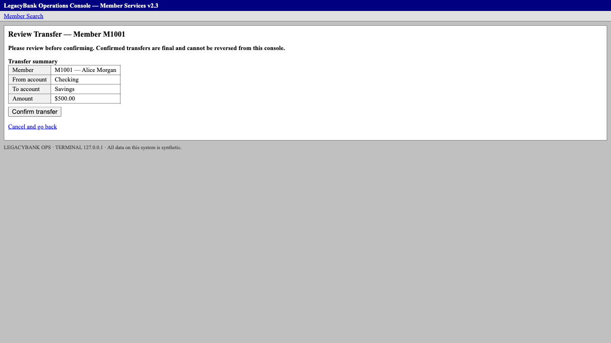
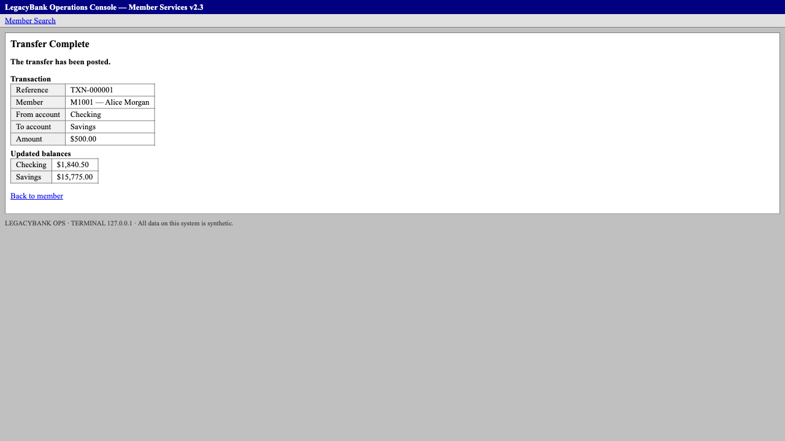
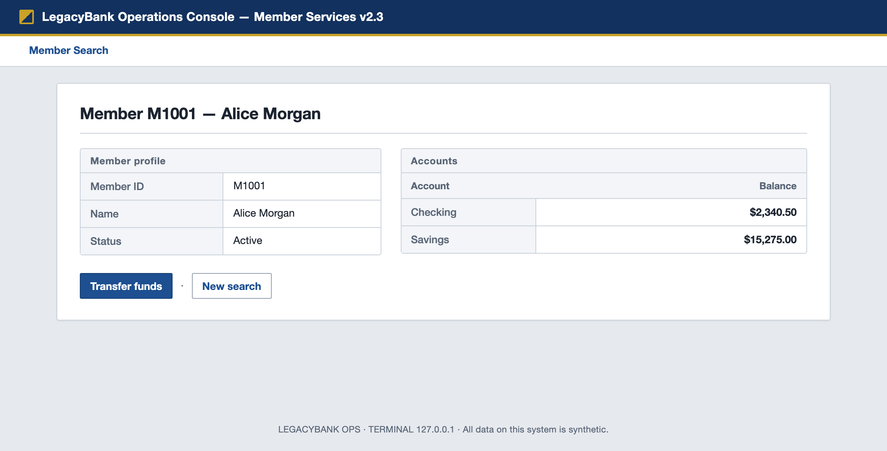

# LegacyBank Capability Compiler

[](https://github.com/Lalithabarri/Lalitha-Bank.LLM/actions/workflows/ci.yml)

Teach the AI once. Replay without it.

A real LLM drives a legacy banking console **once** — observe, decide, act, under a policy gate —
until the goal is met. The successful trace is **compiled** into a typed, versioned, parameterized
capability artifact. From then on a deterministic engine **replays** that artifact for other members in the
target with **zero model decisions**. Every automated action passes through one policy chokepoint; an
irreversible action (a money transfer) is never dispatched by automation — the **same live browser
session** is handed to a human, and automation resumes only after it has **deterministically
verified** what the human did. Every claim below is backed by a committed eval and committed
evidence. Production-style architecture, synthetic target, single process.

```
        discover once (LLM)                     production path (no model)
 ┌──────────────────────────┐            ┌──────────────────────────────────┐
 │ DiscoveryAgent           │            │ ReplayEngine                     │
 │  observe → decide → act  │  trace     │  bind inputs → resolve targets   │
 │  gpt-5.6-sol proposes,   ├──────────► │  → verify postconditions         │
 │  code validates          │  compile   │  → typed outputs                 │
 └────────────┬─────────────┘            └────────────┬─────────────────────┘
              │ every action                          │ every action
              ▼                                       ▼
        ┌──────────────── ActionGate (allowlist · risk tiers · ControlOwner) ────────────────┐
        │  ALLOW → Surface.act     DENY → failure     IRREVERSIBLE → REQUIRE_INTERVENTION    │
        └──────────────────────────────────────┬─────────────────────────────────────────────┘
                                               ▼
                        Surface (accessibility-first: role + name + table/row/group scope)
                                               ▼
                        Legacy Bank Operations Console (local, synthetic, no test ids)

   human handoff: PENDING_HUMAN → HUMAN (same browser, page, session_id) → RETURNING → verified → AUTOMATION
   evidence: redacted JSONL chronology per run + pre/post screenshots for interventions
```

## Proof

| Claim | Eval | Committed evidence |
|---|---|---|
| **E01** — a genuine live OpenAI (`gpt-5.6-sol`) discovery reads a member's savings balance: 5 real model calls, 4 gated UI actions, `GOAL_REACHED`, the member id never sent to the provider | `tests/evals/test_e01_evidence.py` (offline audit of the run); `scripts/verify_live.sh e01` re-runs it | [`evidence/discovery/run_e49e4d0cbe09/`](evidence/discovery/run_e49e4d0cbe09/events.jsonl) |
| **Compiler** — the persisted E01 record compiles deterministically into a typed artifact with a per-field derivation report (invariants I1–I6); the compiler cannot read the handwritten bootstrap artifact and does no I/O; committed output recompiles byte-for-byte | `tests/artifact/test_compiler.py`, `tests/artifact/test_compiler_independence.py` | [`capabilities/generated/read_savings_balance@1.0.0.json`](capabilities/generated/read_savings_balance@1.0.0.json) + [compile report](capabilities/generated/compile_reports/read_savings_balance@1.0.0.json) |
| **E02** — that generated artifact replays a *different* member (M1002 → `Decimal("4120.75")`) in a fresh interpreter whose import guard forbids `openai`, `cua.llm`, `cua.discovery` and the compiler itself | `tests/evals/test_e02_compile_replay.py` | [`evidence/replay/run_50600b9540ca/`](evidence/replay/run_50600b9540ca/events.jsonl) |
| **E03 / E04 / E05 / E06** — zero-LLM replay is structural (no dependency slot, fresh-interpreter guard); "no such member" is a `BUSINESS_OUTCOME`, never a crash; two equivalent Savings cells fail closed with zero READ; an empty policy denies before the first action | `tests/replay/test_zero_model.py`, `tests/replay/test_replay_live.py`, `tests/policy/`, `tests/cua/test_boundaries.py` | [`evidence/replay/`](evidence/README.md) samples |
| **E08** — real same-session handoff: the gate stops the irreversible "Confirm transfer" click, the human clicks it in the **same headed Chromium session**, hands back in the terminal, and the engine verifies the posted-transfer state before continuing | `tests/evals/test_e08_evidence.py` (audit of the run), `tests/hitl/test_handoff.py` (simulated state machine); `scripts/verify_live.sh e08` re-runs it | [`evidence/replay/run_af80d82668bc/`](evidence/replay/run_af80d82668bc/events.jsonl) |
| **E09** — no repeat: the human-completed step is `completed_by=HUMAN`, `dispatched=false`; automation dispatched s1, s2, s3, s5 and never s4; unverifiable completion is `FAILURE / UNKNOWN_COMMIT_STATE`, `safe_to_retry=false` | same run + `tests/hitl/test_handoff.py::test_verified_completion_with_done_advances_past_the_step_and_never_redispatches_it` | same run, `RUN_COMPLETED` · `SUCCESS` · `transfer_reference = TXN-000001` |
| **E10** — a sentinel runtime input never survives into URLs, alerts, error text or any persisted line; no credential shape, ref, selector or absolute path in anything committed | `tests/replay/test_engine.py` (sentinel), `tests/evidence/test_redaction.py`, `scripts/public_audit.py` | every `events.jsonl` line carries `redaction_applied: true` |

## Verify it in one command

```sh
uv sync && uv run playwright install chromium   # one-time: fetches locked deps + Chromium
scripts/verify.sh                                # offline: no API key, no provider call, no human
```

`verify.sh` runs lint, the structural boundary checks, every eval above, the whole suite and the
public-artifact audit, and prints one `PASS` line per eval (about 30 s; `--no-browser` skips the
real-Chromium proofs). It needs no `OPENAI_API_KEY`, makes no live OpenAI call, asks nothing of a
human and touches no live banking target; the verification workload talks only to the in-process
console on localhost (the suite refuses any non-loopback socket). Only the one-time dependency
install above may reach a package registry. The same script runs on every push to `main` on a
clean Ubuntu runner ([`.github/workflows/ci.yml`](.github/workflows/ci.yml), no secrets). The two
proofs that need the outside world — a live model and a human — are audited from their committed
runs and can be re-run with `scripts/verify_live.sh`.

## The handoff, as it happened (E08, `run_af80d82668bc`)

| PRE — automation stopped at the gate | POST — the state the verifier accepted |
|---|---|
|  |  |
| `GATE_DECISION REQUIRE_INTERVENTION` for `CLICK button "Confirm transfer"`; zero driver dispatch; owner AUTOMATION → PENDING_HUMAN → HUMAN | after the human's click and `done`: HUMAN → RETURNING, a fresh observation satisfies `status` "The transfer has been posted.", `INTERVENTION_VERIFIED completed_by=HUMAN`, RETURNING → AUTOMATION, s5 reads `TXN-000001` |

The chronology is one `events.jsonl` with one run id and one session id; the screenshots are
referenced by run-relative path, sha256 and media type (bytes never enter the JSONL). The pixels
show the synthetic member because screenshots are not redacted — a documented V1 limit; every
structured line is.

## The target

`uv run legacy-bank` serves the synthetic Legacy Bank Operations Console on `:8000`: a
server-rendered Flask app with real accessibility semantics (roles, labels, captions, row headers)
and no test ids. The flagship capability reads the Savings cell below; the transfer capability
drives the form behind "Transfer funds" up to the gated "Confirm transfer" click.



## Quick demo path

```sh
uv run legacy-bank                                   # terminal 1: the synthetic console on :8000

# 1. discover (real model; needs OPENAI_API_KEY) — writes evidence/discovery/<run_id>/
CUA_LIVE_API=1 uv run python -m tests.evals.e01_live_discovery --live --evidence-root evidence

# 2. compile a persisted discovery record into an artifact + compile report (no model)
uv run python -m tests.evals.e02_compile_replay --compile-only \
    --run-id <run_id> --evidence-root evidence --capabilities-root /tmp/caps
#    (omit --run-id to compile the committed official E01 record)

# 3. replay the generated artifact for another member, zero model, fresh guarded interpreter
uv run python -m tests.replay.zero_model_replay \
    --artifact /tmp/caps/read_savings_balance@1.0.0.json --member M1002 --live

# 4. same-session human handoff (headed; click "Confirm transfer" when prompted, type done)
CUA_LIVE_HITL=1 uv run python -m tests.evals.e08_hitl_live --live --evidence-root evidence
```

Without a key or a browser: step 2 works on the committed E01 record, and every replay proof runs
against a scripted surface built from real accessibility captures (`scripts/verify.sh --no-browser`).

## What live testing caught

The first manual headed run failed *before* the handoff, at the amount field. Playwright's
accessibility snapshot serialises number-looking text as a YAML-quoted scalar
(`- textbox "Amount": "500.00"`), and the ARIA reader kept the quotes, so the deterministic
`value_equals` postcondition compared `"500.00"` (with quotes) against `500.00` and failed
closed after its bounded wait. The flagship flow never exposed this because a member id is not
number-like. The fix was made at the ARIA parsing boundary — a fully quoted scalar is unquoted
with the same escape rules as accessible names, nothing else changes — and pinned by a parser
regression test and a real-browser test that drives the transfer to the gate. Deterministic
verification did its job: it refused, and the evidence said exactly where.

## How it works

- **Discovery** (`cua/discovery`, `cua/llm`): the model sees a model-safe observation (runtime
  inputs templated to `<input:name>`), proposes one typed action from a closed vocabulary, and
  deterministic code validates it against the raw observation (stale refs, illegal targets,
  ambiguity, undeclared outputs) before the gate sees it. `FINISH` is a proposal; a deterministic
  verifier establishes `GOAL_REACHED`. Bounded by steps and time.
- **Compiler** (`cua/artifact/compiler.py`): a pure function of the persisted discovery record and
  a declared capability contract. Targets are exactly the descriptors discovery proved unique
  (role + name + row/group scope; no fallback, never `first()`); postconditions and the success
  checkpoint are derived only from recorded routes and bindings — the compiler refuses to invent
  stronger conditions than the trace justifies, and fails with a closed error vocabulary rather
  than guess.
- **Artifact** (`cua/artifact/schema.py`): typed, versioned (`schema_version` vs
  `capability_version`), parameterized (`INPUT_REF`), ordered steps, semantic targets, declarative
  postconditions and checkpoint, declared business outcomes, per-step risk, provenance. No refs,
  selectors, code, secrets or model text can be expressed.
- **Replay** (`cua/replay`): `ReplayDeps` has no slot for a model. Bounded observation polls,
  fail-closed ambiguity, exactly three terminal results (`SUCCESS | BUSINESS_OUTCOME | FAILURE`
  with step, expected, observed).
- **Policy** (`cua/policy`): deny-by-default allowlist of origins, routes and action types,
  evaluated on the resolved execution target; risk tiers where the highest matching rule wins;
  `IRREVERSIBLE → REQUIRE_INTERVENTION`; `DENY` is never turned into approval.
- **HITL** (`cua/hitl`): one shared `ControlOwner` with four edges; the intervention handler
  receives only the request — it cannot reach the browser; the step's own postcondition is the
  verifier; `done`/`abort` are hand-back signals, never transaction truth.
- **Evidence** (`cua/evidence`): redaction before disk, `ACTION_DISPATCHED` at the driver
  boundary as ground truth, one chronology per run.

Canonical design documents: [REQUIREMENTS.md](REQUIREMENTS.md) → [ARCHITECTURE.md](ARCHITECTURE.md)
→ [ENGINEERING_DECISIONS.md](ENGINEERING_DECISIONS.md); the write-up is [REPORT.md](REPORT.md);
the milestone ledger is [PROJECT_STATUS.md](PROJECT_STATUS.md); evidence layout is
[evidence/README.md](evidence/README.md).

## Setup

Requires [uv](https://docs.astral.sh/uv/) and Python 3.12 (uv installs one if needed).

```sh
uv sync
uv run playwright install chromium   # Chromium only; browser tests skip with a reason without it
uv run pytest -q                     # offline suite (live evals are opt-in: CUA_LIVE_API=1 / CUA_LIVE_HITL=1)
```

Configuration lives in environment variables only: `OPENAI_API_KEY` (discovery only; never
persisted), `CUA_OPENAI_MODEL` (default `gpt-5.6-sol`), `CUA_EVIDENCE_ROOT` /
`CUA_CAPABILITIES_ROOT` (where opt-in runs write). The policy is `policy/legacy_bank.json`.
Synthetic members: `M1001`, `M1002` (valid), `M404` (absent); all data is fake and in-memory.

```
src/cua/          discovery · llm · artifact (schema, compiler, store) · replay · policy · hitl · evidence · surface
src/legacy_bank/  the synthetic target (Flask, server-rendered, no test ids)
capabilities/     handwritten bootstrap + transfer capability; generated/ holds compiler output
evidence/         committed runs: E01 discovery, E02 replay, E08/E09 handoff, M4/M5 samples
tests/            unit, structural, live-browser and eval tests; tests/evals holds the eval runners
scripts/          verify.sh · verify_live.sh · public_audit.py
```
